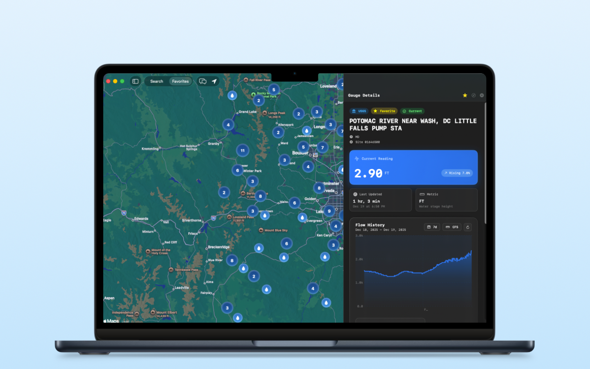

<div align="center">
  
# Gauge Watcher

**Near-real-time river flow monitoring for iOS & macOS**

[](https://opensource.org/licenses/MIT)
[](https://developer.apple.com)
[](https://swift.org)
[](https://github.com/pointfreeco/swift-composable-architecture)



*A complete reboot of the original [GaugeWatcher](https://apps.apple.com/us/app/gaugewatcher/id6498313776), rebuilt from scratch to explore iOS 26, macOS 26, and SwiftData alternatives.*

---

[Features](#features) • [GaugeBot AI](#gaugebot-ai-assistant) • [Installation](#installation) • [Architecture](#architecture) • [Contributing](#contributing)

---

</div>

> [!WARNING]
> This is very much a work in progress. There will be bugs, incomplete features, and other issues. Please report them!

## Features

<table>
<tr>
<td width="50%">

### 🌊 Multi-Source Gauge Data

Access water flow data from agencies worldwide:

- **USGS** — United States Geological Survey
- **Environment Canada** — BC, ON, QC provinces
- **Colorado DWR** — Department of Water Resources
- **LAWA** — Land, Air, Water Aotearoa (New Zealand)

</td>
<td width="50%">

### 🤖 GaugeBot AI Assistant

Chat with an on-device AI assistant powered by Apple Intelligence:

- Search gauges using natural language
- Check your favorites instantly
- Get information about water conditions
- Runs entirely on-device — no data leaves your Mac

</td>
</tr>
<tr>
<td width="50%">

### 🗺️ Interactive Map

- Search and browse gauges by location
- Visual clustering for dense areas
- Location-aware gauge discovery

</td>
<td width="50%">

### 📊 Historical Charts & Offline-First

- View gauge reading trends over time
- Customizable time periods
- Local SQLite database with intelligent caching

</td>
</tr>
</table>

---

## GaugeBot AI Assistant

GaugeBot is an on-device AI chat assistant powered by **Apple Intelligence** and the Foundation Models framework.

### Capabilities

> See [GaugeBot Tools](/SharedFeatures/Sources/SharedFeatures/Feature/GaugeBot/Tools/) to see the available tools.

| What You Can Ask | Example Prompts |
|------------------|-----------------|
| **Search Gauges** | "Find gauges on the Arkansas River" • "What gauges are in Colorado?" |
| **Check Favorites** | "Show me my favorite gauges" • "What are my saved stations?" |
| **Get Information** | Ask about specific rivers, locations, or gauge data |

### Requirements

| Requirement | Details |
|-------------|---------|
| **Platform** | iOS 26.0+ / macOS 26.0+ (Apple Silicon) |
| **Apple Intelligence** | Must be enabled on your device |
| **Language Model** | Downloads automatically when Apple Intelligence is enabled |

> [!NOTE]
> GaugeBot runs entirely on-device using Apple's Foundation Models framework. No data is sent to external AI services — all processing happens locally.

### Availability

GaugeBot is currently available on **iOS and macOS**. The feature gracefully degrades on unsupported devices or when Apple Intelligence is not enabled, showing helpful guidance on how to enable it.

---

## Installation

### Requirements

| Tool | Version |
|------|---------|
| iOS | 26.0+ |
| macOS | 26.0+ |
| Xcode | 26.0+ |
| Swift | 6.0+ |
| Docker | Latest |
| [openapi-generator](https://openapi-generator.tech/) | For forecast server Swift client |

### Quick Start

```bash
# Clone the repository
git clone https://github.com/drewalth/gauge-watcher.git
cd gauge-watcher

# Copy environment template
cp .env.example .env

# Run setup
./scripts/setup.sh

# Open in Xcode
xed .
```

### Configuration

<details>
<summary><strong>Analytics (Optional)</strong></summary>

Edit `.env` and add your PostHog credentials:

```env
POSTHOG_API_KEY=phc_your_api_key_here
POSTHOG_HOST=https://us.i.posthog.com
```

> The app works without analytics configured — telemetry will simply be disabled.

</details>

<details>
<summary><strong>Development Team Setup</strong></summary>

Before building, set your Apple Development Team:

1. Open the project in Xcode
2. Select the `GaugeWatcher` target
3. Go to **Signing & Capabilities**
4. Select your Development Team from the dropdown

</details>

<details>
<summary><strong>Flow Forecast Server (Optional)</strong></summary>

The app includes a flow forecasting feature for USGS gauges that requires a local Python server.

```bash
cd server/flow-forecast
./run.sh
```

The server runs on `http://localhost:8000` by default. If you don't run the forecast server, the app will still work — the forecast feature will simply show as unavailable.

> If you run into an issue loading the `FlowForecast` Swift package, run `make generate_clients` from the `server/flow-forecast` directory to regenerate the Swift client.

</details>

### Dependencies

- [swift-composable-architecture](https://github.com/pointfreeco/swift-composable-architecture) — App architecture
- [SQLiteData](https://github.com/pointfreeco/sqlite-data) — Database layer
- Custom local packages for modularity (GaugeSources, GaugeDrivers, AppTelemetry, UIAppearance)

---

## Building & Running

| Platform | Scheme | Command |
|----------|--------|---------|
| **iOS** | `GaugeWatcher` | ⌘R in Xcode |
| **macOS** | `GaugeWatcherMac` | ⌘R in Xcode |

The macOS app features a sidebar/detail layout with an interactive full-screen map.

### Scripts

| Script | Description |
|--------|-------------|
| `./scripts/test.sh` | Run all tests |
| `./scripts/format.sh` | Format and lint code |
| `./scripts/lint.sh` | Run linter only |
| `./scripts/check-leaks.sh` | Check for secrets/leaks |

---

## Architecture

The app follows **The Composable Architecture (TCA)** pattern with unidirectional data flow.

```
┌─────────────────────────────────────────────────────────────────────────┐
│                              Applications                               │
├──────────────────────────────────┬──────────────────────────────────────┤
│          GaugeWatcher            │          GaugeWatcherMac             │
│          (iOS App)               │          (macOS App)                 │
└──────────────────────────────────┴──────────────────────────────────────┘
                                   │
                    ┌──────────────┴──────────────┐
                    │       SharedFeatures        │
                    │   (Cross-platform TCA)      │
                    └──────────────┬──────────────┘
                                   │
        ┌──────────────────────────┼──────────────────────────┐
        │                          │                          │
┌───────┴───────┐         ┌────────┴────────┐        ┌────────┴────────┐
│  GaugeSources │         │  GaugeDrivers   │        │  GaugeService   │
│  (Definitions)│         │  (API Clients)  │        │  (Data Layer)   │
└───────────────┘         └─────────────────┘        └────────┬────────┘
                                                              │
                                                     ┌────────┴────────┐
                                                     │   AppDatabase   │
                                                     │    (SQLite)     │
                                                     └─────────────────┘
```

### Key Patterns

- **Repository pattern** for data access (GaugeService, GaugeSourceService)
- **Driver pattern** for API integrations (one driver per data source)
- **Dependency injection** via TCA's dependency system

### Module Responsibilities

<details>
<summary><strong>View all modules</strong></summary>

| Module | Responsibility |
|--------|----------------|
| **GaugeWatcher** | Main iOS app container, features, and UI |
| **GaugeWatcherMac** | Native macOS app with NavigationSplitView layout |
| **SharedFeatures** | Cross-platform TCA reducers and state management |
| **GaugeSources** | Static gauge definitions, state/province configs |
| **GaugeDrivers** | Network clients for each provider's API |
| **GaugeService** | Database queries, data sync, business logic |
| **AppDatabase** | SQLite schema definitions using SQLiteData |
| **AppTelemetry** | Event tracking and analytics abstraction |
| **UIAppearance** | Design system components, colors, and assets |
| **UIComponents** | Reusable SwiftUI view components |

</details>

---

## Testing

### Test Suites

| Suite | Coverage |
|-------|----------|
| `GaugeDriversTests` | API driver tests |
| `GaugeSourcesTests` | Gauge data parsing |
| `GaugeWatcherTests` | iOS app integration |
| `GaugeWatcherMacTests` | macOS app integration |
| `SharedFeaturesTests` | Cross-platform features |

### Running Tests

```bash
# Test all packages
./scripts/test.sh

# Test individual packages
swift test --package-path ./GaugeSources
swift test --package-path ./GaugeDrivers
```

---

## Contributing

Contributions are welcome! Feel free to open an issue or pull request.

> [!NOTE]
> This is a small hobby project — mostly an excuse to learn new things. If you're interested in projects with real-world impact, consider contributing to [American Whitewater](https://americanwhitewater.org/), [Whitewater NZ](https://whitewater.nz), or [BC Whitewater](https://www.bcwhitewater.org).

### Prerequisites

Install [gitleaks](https://github.com/gitleaks/gitleaks) to check for secrets before pushing changes.

### Adding New Gauge Sources

1. Add gauge definitions to `GaugeSources/Sources/GaugeSources/Resources/`
2. Implement a new driver in `GaugeDrivers/Sources/GaugeDrivers/`
3. Extend `GaugeDrivers.swift` unified API
4. Add comprehensive tests for your driver
5. Update documentation

---

## Data Sources

| Provider | Documentation |
|----------|---------------|
| USGS | [waterservices.usgs.gov](https://waterservices.usgs.gov) |
| Environment Canada | [dd.weather.gc.ca](https://dd.weather.gc.ca) |
| Colorado DWR | [dwr.state.co.us/Tools](https://dwr.state.co.us/Tools) |
| LAWA | [lawa.org.nz](https://www.lawa.org.nz) |

---

## Acknowledgments

- [@ajbonich](https://github.com/ajbonich) — Initial forecasting server implementation
- [@ngottlieb](https://github.com/ngottlieb) — Canadian gauge data guidance

---

<div align="center">

Made with ☕ for paddlers everywhere

</div>
